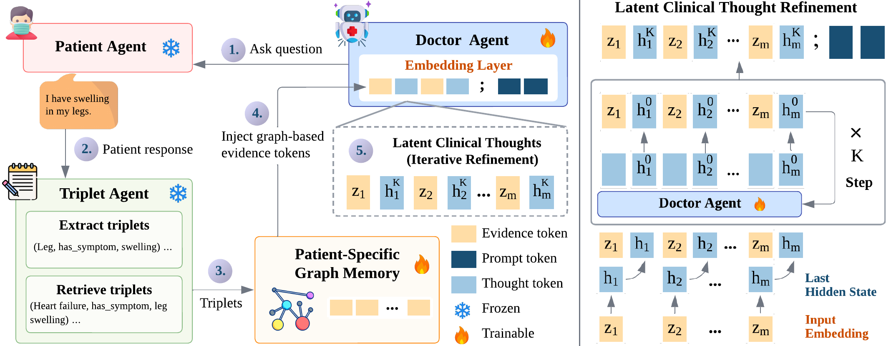

# GraphMed-LT

**Patient-Specific Graph Memory with Latent Clinical Thought Refinement for Multi-Turn Medical Conversations**

## Overview

We propose GraphMed-LT, a patient-specific graph memory approach with latent clinical thought refinement for multi-turn medical conversations. GraphMed-LT extracts patient-specific clinical triplets from patient responses, retrieves relevant knowledge triplets, and organises them into an incrementally updated graph memory. The graph memory is projected into graph-conditioned evidence tokens and refined inside a trainable doctor agent through hidden-state feedback, enabling the agent to update its internal clinical context before asking follow-up questions or producing the final answer.

<p align="center">
  
</p>

## Method

GraphMed-LT consists of a patient agent, a triplet agent, a patient-specific graph memory module, and a trainable doctor agent. The patient agent returns responses grounded in the complete patient record. The triplet agent extracts patient-specific triplets from patient responses and retrieves the top-3 relevant knowledge triplets from an external triplet corpus. The graph memory is initialised as `G_0` using triplets extracted from the initial patient description `p_0` and is updated across turns by adding clinical entities and relation-labelled edges. Source-aware edge types distinguish patient-observed triplets from retrieved background knowledge. The graph memory is encoded with a GAT, projected into graph-conditioned evidence tokens, and integrated into the doctor agent through latent clinical thought refinement.

## Installation

```bash
conda env create -f environment.yml
conda activate GraphMed-LT
```

## Training

The main training entry point is `projection_train.py`.

```bash
python projection_train.py \
  --train_file data/all_train_convo.jsonl \
  --expert_model Qwen/Qwen2.5-72B-Instruct \
  --triplet_model Qwen/Qwen2.5-72B-Instruct \
  --distributed_backend fsdp \
  --triplet_corpus path/to/primekg_triplets.jsonl \
  --retrieval_top_k 3 \
  --prefix_len 20 \
  --refinement_steps 5 \
  --gnn_model gat \
  --gnn_in_dim 256 \
  --gnn_hidden_dim 256 \
  --gat_heads 4 \
  --lr 1e-5 \
  --weight_decay 0.01 \
  --batch_size 64 \
  --epochs 5
```

The code expects the external triplet corpus to be provided locally and does not include PrimeKG triples in this repository. The BiCA encoder defaults to `bisectgroup/BiCA-base` and can be changed with `GRAPHMED_BICA_MODEL`.


## Benchmark

```bash
python GraphMedLT_benchmark.py \
  --expert_module expert --expert_class ScaleExpert \
  --expert_model save_model/doctor_agent \
  --patient_module patient --patient_class FactSelectPatient \
  --data_dir data --dev_filename all_dev_good.jsonl \
  --projection_ckpt save_model/graphmed_lt.ckpt \
  --triplet_corpus path/to/primekg_triplets.jsonl \
  --output_filename results/graphmed_lt_dev.jsonl \
  --max_questions 10
```

## License

This repository is released under the MIT License.
